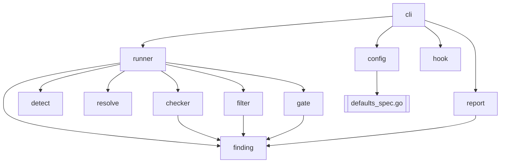

# Architecture

Lintel is a modestly-sized Go codebase (~4k lines, no generics tricks, no reflection-heavy framework). This page gives a map you can hold in your head.

## Module layout

```
lintel/
├── cmd/lintel/              # main package; thin wrapper around internal/cli
├── internal/
│   ├── cli/                # cobra commands (init, install, run, doctor, …)
│   ├── config/             # YAML types, loader, defaults, validation
│   ├── detect/             # staged-file + stack detection
│   ├── resolve/            # binary resolution + hash verification
│   ├── checker/            # scanner adapters (one file per scanner)
│   ├── runner/             # parallel execution, timeouts, normalization
│   ├── filter/             # allowlist + baseline + inline-ignore filters
│   ├── finding/            # Finding struct, severity, fingerprint
│   ├── gate/               # threshold evaluation
│   ├── hook/               # pre-commit / pre-push shim handling
│   ├── report/             # pretty + JSON output renderers
│   └── version/            # build-time version/commit/date ldflags
├── docs/                   # this MkDocs site
├── examples/               # reference lintel.yaml configs
├── testdata/               # canned scanner outputs for adapter tests
└── .github/                # workflows, templates, CODEOWNERS
```

## Package dependencies



Arrows point "depends on." No import cycles. `internal/finding` is the common vocabulary.

## Adding a new scanner

The codebase makes this deliberately small:

1. Implement the `Checker` interface in a new file under `internal/checker/`.
2. Register it in `internal/checker/registry.go`.
3. Add a default config entry in `internal/config/defaults_spec.go` with SHA256 pins for supported platforms.
4. Add a normalization test that feeds a canned output blob through the adapter and asserts a stable `[]Finding`. Put the blob in `testdata/`.
5. Write a docs page under `docs/docs/scanners/<name>.md` and add it to `mkdocs.yml`.

The full checklist is in [Adding a scanner](adding-a-scanner.md).

## Testing strategy

| Layer                 | Tests                                                              |
| --------------------- | ------------------------------------------------------------------ |
| Config load           | Round-trip YAML + schema error fixtures (`internal/config/*_test.go`) |
| Detect                | Table-driven: path sets → stack classifications                    |
| Resolve               | Temp binaries with known SHA256; verifies match + mismatch paths   |
| Checker adapters      | Canned scanner output → normalized findings                        |
| Filter                | Each filter in isolation; precedence covered by a combined suite   |
| Gate                  | Threshold boundary cases                                           |
| Runner                | Synthetic checkers; verifies timeouts, parallelism, ordering       |
| Hook                  | Install / uninstall with pre-existing foreign hooks                |
| End-to-end            | `make smoke` - real `lintel` binary against a fixture repo          |

The matrix is explicit - each package has at least one `_test.go` file with table-driven cases. There is no hidden test infrastructure.

## Design rules

1. **One binary, no runtime.** CGO disabled; no `os/exec` to interpreters.
2. **No hidden state.** Every config knob lives in `lintel.yaml`. Behaviors keyed off environment variables are listed in [env vars](reference/env-vars.md).
3. **Deterministic output.** Same inputs → same bytes out.
4. **Fail loud on supply-chain surprises.** Missing or mismatched hashes halt the run by default; the operator must take explicit action to override.
5. **Small interfaces.** `Checker`, `Filter`, `Reporter` are each a few methods. Resist generic frameworks; prefer explicit wiring.
