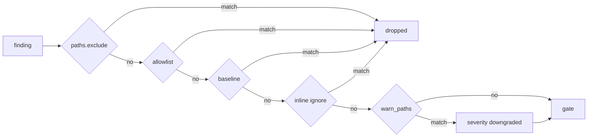

# Baseline and allowlist

When you adopt Aegis on an existing codebase, you usually have findings from day zero that you don't want to fix immediately but don't want to block commits either. Aegis gives you three layered tools for this, in increasing specificity.

| Tool            | Scope                              | File                             | Audit trail |
| --------------- | ---------------------------------- | -------------------------------- | ----------- |
| `paths.exclude` | Whole paths, never scanned         | `aegis.yaml`                     | YAML diff   |
| Allowlist       | Specific rule-on-path, suppressed  | `.aegis/allowlist.yaml`          | YAML diff + required reason |
| Baseline        | Accept everything currently found  | `.aegis/baseline.json`           | JSON diff   |
| Inline ignore   | One line or block                  | In the source file               | Required reason in comment |

Pick the least-broad tool for the job.

## Allowlist

An allowlist entry permanently suppresses a (scanner, rule, optional file pattern) tuple. Every entry requires a `reason` string — reviewers can verify the judgment.

```yaml
# .aegis/allowlist.yaml
version: 1
entries:
  - scanner: gitleaks
    rule: generic-api-key
    files: ["testdata/**"]
    reason: "Test fixtures contain placeholder keys."
  - scanner: golangci-lint
    rule: G104
    files: ["internal/legacy/**"]
    reason: "Legacy module scheduled for rewrite in Q3."
```

Managing from the CLI:

```bash
aegis ignore add --scanner gitleaks --rule generic-api-key \
  --files 'testdata/**' --reason "Test fixtures"
```

`aegis ignore` refuses to add an entry without a reason.

## Baseline

The baseline is a snapshot of every finding at a point in time. Anything in the baseline is treated as known and is excluded from the gate. Anything **new** fails the commit as usual.

```bash
aegis baseline            # snapshot current findings into .aegis/baseline.json
aegis baseline --check    # fail if the baseline is stale compared to current findings
```

The file is JSON — check it in alongside your code. A finding is considered "the same" across runs via its stable fingerprint (see [first scan](first-scan.md#anatomy-of-a-pretty-report)), so cosmetic code moves (renaming a function, shifting lines) still match as long as the (scanner, rule, file, normalized-message) tuple is preserved.

When you fix a finding, re-run `aegis baseline` to shrink the snapshot. CI should run `aegis baseline --check` on pull requests so a PR that fixes a finding doesn't accidentally let the same finding slip back in via the baseline.

### Baseline vs. allowlist

- **Use a baseline** during adoption or a big refactor, when you want to freeze the backlog and fix it down over time. The baseline is meant to shrink.
- **Use the allowlist** for long-lived, per-rule exceptions you have actively judged acceptable. The allowlist is meant to be stable.

!!! tip "Reviewability"
    Both files are intentionally diffable in PRs. Reviewers should push back on growing baselines and vague allowlist reasons — they are the mechanism for preventing silent regressions.

## Inline ignores

See [severities § inline ignores](severities.md#inline-ignores). Inline directives are the most surgical tool and also the most visible at the point of change, so they are preferred for targeted, permanent accept-this-one-spot cases.

## Precedence

Filters run in this order; once a finding is suppressed it does not propagate further:



The full precedence and rationale are documented in [`spec.md` §14](reference/spec.md#14-allowlist-baseline-and-inline-ignores).
