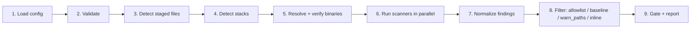

# The pipeline

Every `aegis run` invocation executes the same nine stages in order. Understanding the pipeline makes configuration, debugging, and CI behavior much easier to predict.



Each stage is an explicit module under [`internal/`](https://github.com/aegis-sec/aegis/tree/main/internal) — you can read the code directly. The stages:

## 1. Load config

Reads `.aegis/aegis.yaml`, merging with built-in defaults from [`internal/config/defaults_spec.go`](https://github.com/aegis-sec/aegis/blob/main/internal/config/defaults_spec.go). Env var overrides are applied last.

Failure mode: **exit 2** (config error).

## 2. Validate

Schema, range, and cross-reference validation: `gate.fail_on` numeric, scanner references under `checks.lint.scanners` exist, every listed scanner has either a path + SHA256 pair or `strict_versions: false`.

Failure mode: **exit 2**, with a line-accurate error.

## 3. Detect staged files

Determines which files are in scope.

| Invocation                    | Scope                                         |
| ----------------------------- | --------------------------------------------- |
| `aegis run --hook pre-commit` | `git diff --cached --name-only`               |
| `aegis run --hook pre-push`   | Commits about to be pushed, via `git rev-list` |
| `aegis run` (no hook)         | Working tree modifications — everything unignored |

Files in `paths.exclude` globs are dropped here.

## 4. Detect stacks

The file list is classified into stacks (`go`, `npm`, `python`, `shell`, …). See [stacks](stacks.md) for the rules.

## 5. Resolve and verify binaries

For every enabled check, Aegis picks the right scanner based on stack, then:

1. Resolves its path (absolute or via `$PATH`).
2. Runs the scanner's `--version` command.
3. Computes the SHA256 of the binary on disk.
4. Compares against the pinned version + hash.

Failure mode: **exit 3** (binary missing, version mismatch, or hash mismatch). With `strict_versions: true` (default), any of these fail the whole run. With `strict_versions: false`, only the offending scanner is skipped with a warning.

This is the stage that makes Aegis' supply-chain model meaningful — see [supply-chain](supply-chain.md).

## 6. Run scanners in parallel

Each (check, stack, scanner) triple runs as a separate goroutine with:

- A per-check timeout (`timeouts.per_check`).
- A total wall-clock timeout (`timeouts.total`).
- Bounded concurrency (`concurrency.max_parallel`, default: number of CPUs).

A scanner that times out is reported as **exit 4** for that check; the rest continue.

## 7. Normalize findings

Each adapter's raw output (SARIF, JSON, text) is converted into a uniform `Finding` struct:

```go
type Finding struct {
    Check        string   // secrets | malicious_code | dependencies | lint | format
    Scanner      string
    Rule         string
    Severity     Severity // error | warn | info
    File         string
    Line, Column int
    Message      string
    Remediation  string
    Fingerprint  string   // stable across runs
}
```

The fingerprint is the bridge to baselines — it must be stable against cosmetic code movement.

## 8. Filter

Findings flow through a chain of filters (see [baseline-allowlist](baseline-allowlist.md#precedence)): `paths.exclude` → `allowlist` → `baseline` → inline `aegis:ignore` → `warn_paths`.

Each filter keeps a record of what it dropped or downgraded; `--verbose` logs this for debugging.

## 9. Gate and report

The gate computes `error/warn/info` counts against `gate.fail_on` thresholds and emits the final exit code. Simultaneously the report is rendered — pretty by default, JSON when requested.

Exit codes:

| Code | Meaning                                |
| ---- | -------------------------------------- |
| 0    | Gate passed                            |
| 1    | Gate failed                            |
| 2    | Config / CLI error                     |
| 3    | Binary resolve or verification failed  |
| 4    | Scanner crashed or timed out           |

## Determinism

The pipeline produces **byte-identical** output for the same inputs on the same platform:

- Findings are sorted by `(severity desc, scanner, file, line, column, rule, fingerprint)`.
- Timings are not written to JSON (only pretty output).
- Parallel scanning does not affect output order — collection happens before sort.

This matters for CI diff-based tools, for caching, and for reproducible builds.
